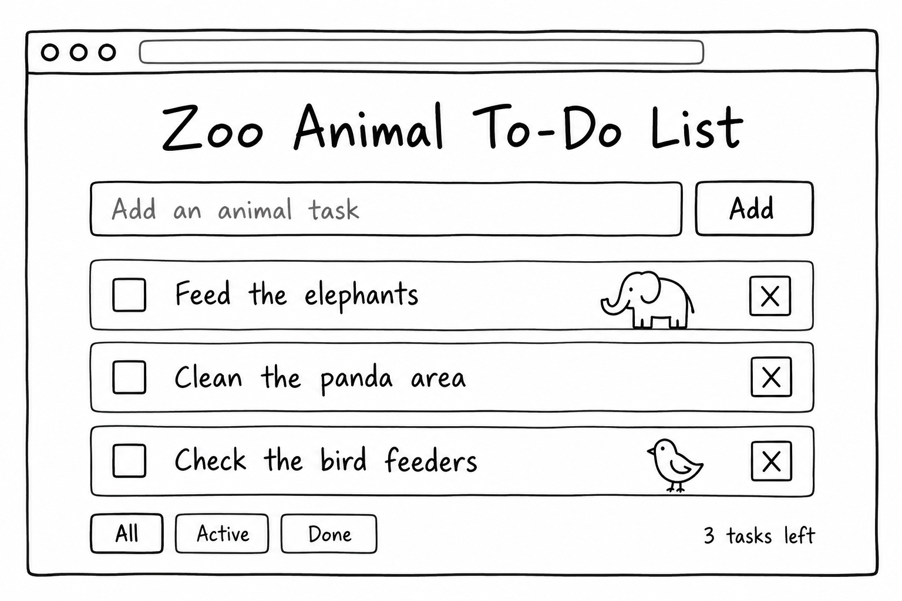
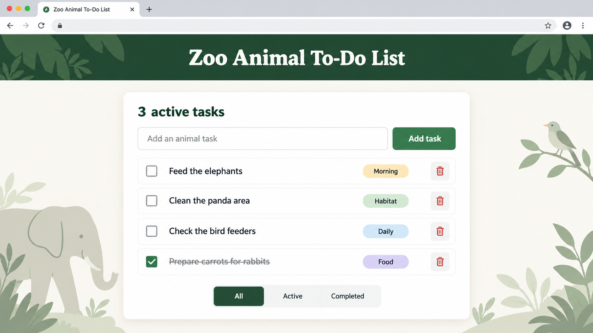

# Project name

**Author(s):** Write your name / the names of all authors here

## Project plan

### Project idea

Briefly describe what your application does and who it is intended for.

### Planned features

List at least three features you plan to include in your application:

- Feature 1
- Feature 2
- Feature 3

### Wireframe / sketch

Add an image of your hand-drawn or digitally created application wireframe here. The wireframe should show the main view and the most important elements of your application.

Example:

## Web links

- **Published application:** [Add your GitHub Pages URL here](https://yourusername.github.io/your-repository/)
- **GitHub repository:** [Add your repository URL here](https://github.com/yourusername/your-repository)
- **Project video presentation:** [Add your video URL here](https://example.com/)

## About the application

**[Project name]** is a web application that ...

Briefly describe the purpose of your application and its main features.

## Technologies

Describe the technologies you used and their role in your project.

- HTML – page structure
- CSS – styling and layout
- JavaScript – functionality, DOM scripting and form validation
- localStorage – saving data in the browser, if used

## How to use the application

Write short instructions for using the application.

1. Open the published application using the link above.
2. Fill in the form fields.
3. Add, edit, remove or mark items as completed.
4. Refresh the page and check whether data remains available in the browser, if you used localStorage.

## Running the application locally

1. Clone or download this repository to your computer.
2. Open the project folder.
3. Open `index.html` in a web browser.

## Screenshots

Add at least one screenshot of your working application.

Example:

## Known issues / limitations

Describe any known bugs, missing features or other limitations.

If there are no known issues, write: **No known issues.**

## Division of work

*Complete this section only if you worked in a pair.*

Describe how the work was divided and how the collaboration went.

- Author 1: ...
- Author 2: ...

## Self-assessment and learning reflection

Reflect on your work and learning process.

- What did I succeed in?
- What was challenging?
- What would I improve if I had more time?
- What did I learn about HTML, CSS, JavaScript and DOM scripting?
- What remained unclear or what would I like to learn more about?
- My self-assessed project grade: **xx/10 points**

## Sources and acknowledgements

List all sources, tutorials, images and code examples used in your project.

If you used ChatGPT, GitHub Copilot or another AI tool, mention it here and briefly explain how it supported your work.

- [Source or tutorial name](https://example.com/)
- [Image source](https://example.com/)
- AI tool used: ...
  - How the tool was used: ...

## License

This project is licensed under the MIT License.

More information about adding a license to a GitHub repository:  
https://docs.github.com/en/communities/setting-up-your-project-for-healthy-contributions/adding-a-license-to-a-repository